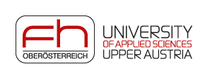



# SRBench Competition 2023: Interpretable Symbolic Regression for Data Science

SRBench hosted its first competition at the [GECCO 2022](https://gecco-2022.sigevo.org/) conference in Boston, MA. 
This competition seeks to distill algorithmic design choices and improve the practice of symbolic regression by evaluating the submitted symbolic regression methods on previously unseen, real-world and synthetic datasets. 
These datasets will be sourced mainly from the domains of physics, epidemiology and bioinformatics.

Participants were asked to adapt and submit their symbolic regression algorithms to SRBench following the [Competition Guide](/srbench/competition-guide/).
These methods were automatically tested for conformance with the competition.
Winners of the *synthetic* and *real-world* track are each entitled to a $1,250 cash prize.  

# Results

In total, there were 13 official competitors. 
After the filtering stage, 9 went on to compete in the synthetic and real-world tracks. 

- **1st Place, Synthetic Track: [QLattice](https://docs.abzu.ai/)**
    - submitted by Meera Vieira Machado & Miquel Triana Iglesias on behalf of Abzu AI

- **1st Place, Real-world Track: [uDSR](https://github.com/brendenpetersen/deep-symbolic-optimization)**
    - submitted by Brenden Petersen,  Mikel Landajuela, Chak Lee, Jiachen Yang, Ruben Glatt, Ignacio Aravena Solis, Claudio Santiago, Nathan Mundhenk

## Synthetic Track Rankings

In the synthetic track, methods were compared according to five properties: 1) re-discovery of exact expressions; 2) feature selection; 3) resistance to local optima; 4) extrapolation; and 5) sensitivity to noise. 

|    | Algorithm     |   Overall Score |
|---:|:--------------|--------------:|
|  1 | GP-Meld         |          xx |
|  2 | PQT          |          xx |
|  3 | DSR |          xx |
|  4 | GP           |          xx |

## Organizers

Please address questions to jiang631 at purdue dot edu. 

- Yexiang Xue
    - University of Applied Sciences Upper Austria
- Nan Jiang
    - Boston Children’s Hospital and Harvard Medical School

<!-- # Sponsors

 

 -->
